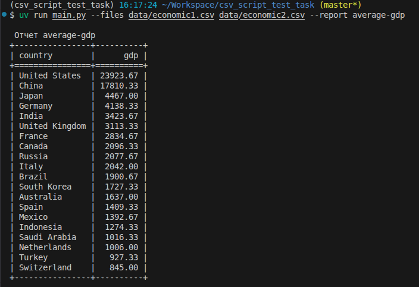

# Скрипт для обработки CSV-файлов

## Возможности

- Чтение и обработка CSV-файлов
- Генерация отчетов
- Вывод результатов в виде таблицы в консоль

## Установка UV (если отсутствует)

```bash
curl -LsSf https://astral.sh/uv/install.sh | sh
```

## Установка зависимостей

```bash
uv sync
```

## Использование

### Запуск отчета average

```bash
uv run main.py --files data/economic1.csv data/economic2.csv --report average-gdp
```

**Параметры:**

- `--files` — пути к CSV-файлам (можно передать несколько файлов через пробел)
- `--report` — тип отчета (по умолчанию `average-gdp`)

## Примеры

Генерирование отчета по среднему ВВП из двух файлов:

```bash
uv run main.py --files data/economic1.csv data/economic2.csv --report average-gdp
```



## Запуск тестов

```bash
uv run pytest
```

Или с подробным выводом:

```bash
uv run pytest -v
```

## Источники информации (по библиотекам):

### CSV:

- https://habr.com/ru/articles/960804/
- https://docs.python.org/3/library/csv.html

### ArgParse

- https://habr.com/ru/companies/ruvds/articles/440654/
- https://docs.python.org/3/library/argparse.html

### Pytest

- https://habr.com/ru/articles/448782/
- https://docs.pytest.org/en/stable/contents.html
- Python Testing with pytest Автор: Okken Brian
